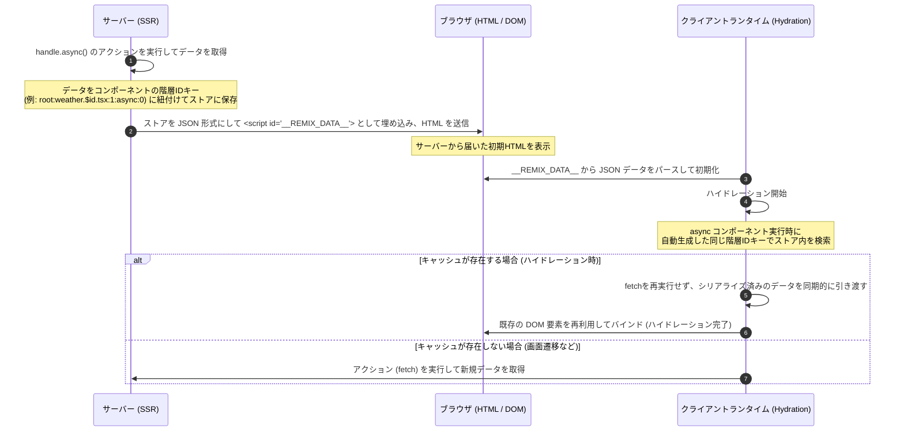

# Remix 3 Sample 06

A sample project for Remix 3 (vDOM) with file-based routing, deployed to Cloudflare Workers.

[Live Demo](https://remix3-sample06.mofon001.workers.dev/)

## 非同期コンポーネント（Async Components）とデータ取得

このサンプルプロジェクトでは、`@remix-run/ui` が提供する非同期コンポーネントとデータ取得の仕組みを使用しています。ルート定義ファイル（例: `src/routes/weather.$id.tsx`）では、セットアップ関数を `async` として定義し、データのフェッチ処理を行うことができます。

```tsx
export default async function (handle: Handle) {
  const { id } = useParams(handle)
  const value = await handle.async<Weather>(() =>
    fetch(`https://api.example.com/weather/${id}`).then((v) => v.json())
  )

  return () => (
    <div>
      <h1>{value.targetArea}</h1>
      {/* ... */}
    </div>
  )
}
```

---

## ハイドレーション時のデータ引き渡しメカニズム

サーバー側で非同期に取得したデータが、クライアント側のハイドレーション後にコンポーネントへどのように引き渡されているかの仕組みは以下の通りです。



### 1. サーバーサイド（SSRフェーズ）
1. サーバー上でのレンダリング時、`handle.async(action)` に渡されたアクション（`fetch` など）が実行され、解決されたデータが一時ストアに蓄積されます。
2. このときデータは、コンポーネントの階層構造から自動生成された**一意な ID キー**（例: `root:weather.$id.tsx:1:async:0`）と紐付けられます。
3. レンダリングの最後で、ストアに蓄積されたすべての非同期データがシリアライズされ、`<script type="application/json" id="__REMIX_DATA__">` タグとしてHTMLの末尾に埋め込まれてブラウザへ送信されます。

### 2. クライアントサイド（ハイドレーションフェーズ）
1. ブラウザにHTMLとJavaScriptが読み込まれると、クライアントのコンポーネントランタイム（`@remix-run/ui`）が起動します。
2. ランタイムはまず DOM 上から `__REMIX_DATA__` をパースし、クライアント側のデータストアに復元して保持します。
3. `createRoot` によるハイドレーション処理が走り、非同期コンポーネントが評価されると、ランタイムはサーバー側と全く同じロジックで一意な ID キー（例: `root:weather.$id.tsx:1:async:0`）を算出します。
4. `handle.async` の呼び出し時、ストア内に該当するキーのデータが存在するか確認します。
   - **データが存在する場合（初期ロード時）**: 渡されたアクション（`fetch`）は再実行されず、ストア内のシリアライズされたデータを即座に Promise として解決します。これによって、無駄なネットワークリクエストを一切防ぎます。
   - **データが存在しない場合（クライアントサイドのページ遷移時など）**: 渡された非同期アクション（`fetch`）が通常どおり実行されます。

### 3. 非同期解決中のハイドレーション保護
ハイドレーションの初回パスでは、async コンポーネントは一時的に `null`（非表示）を返しますが、ランタイムはハイドレーション位置の DOM カーソルを破棄せず `ComponentRuntime` に記憶します。Promise 解決後にその記憶したカーソルを使って既存の HTML に対しハイドレーションを再開するため、画面が一瞬消えたりコンテンツが二重に描画されたりする問題を防ぎ、シームレスなハイドレーションが行われます。

